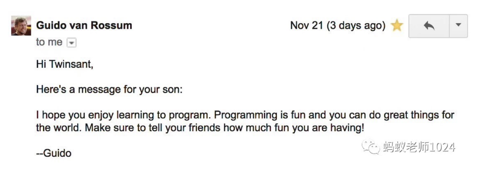

# 002.缩进和循环【修订中】

## Python的缩进

第一期培训班的木木和另一位同学都遇到了这个问题：

<figure><figcaption></figcaption></figure>

&#x20;让我们来补充一下上节课遗漏的一个概念（或者说蚂蚁专门留的一个坑）

> Python代码的缩进

所谓缩进，就是通过空格或者Tab制表符来给每行代码留白

比如

```python
print('我前面没有缩进')
  print('我前面有2个空格')
    print('我前面有4个空格')
```

让我们运行一下

<figure><figcaption><p>额额，出错了出错了</p></figcaption></figure>

为什么会出错呢？

这是因为在Python代码里，缩进是有特殊含义的：


Python中的缩进（多个空格组成）是计算机用来理解代码块的，不同的缩进对应不同层次的代码块


上面出错的情况就是计算机认为「同样层次的代码」应该看起来是对齐的，这样代码的可读性会好一些

所以上面的代码要想正确运行，需要修改成

```python
print('我前面没有缩进')
print('我前面去掉2个空格')
print('我前面去掉4个空格')
```

回到我们的自定义函数

```python
def my_func():
print('我是一个自定义函数，我没有缩进')
```

运行会出错，就是因为计算机认为函数里的代码是一个新的代码块层次，应该缩进来增加可读性


问题：请运行上面的代码，解决这个错误 IndentationError: expected an indented block after function definition on line

回答：<你的回答>


### 赠送阅读

我们来问问ChatGPT它是怎么看待Python的代码缩进的

<figure><figcaption></figcaption></figure>

## Python的循环

重要的事情说三遍

上节课我们学习了自定义函数，还复习了Python的缩进机制，让我们再看一下这个代码

```python
# 程序002.01
def important_foo():
    print('重要的事情')
    
important_foo()
important_foo()
important_foo()
```

important\_foo函数我们写三遍来实现重复的逻辑，Python里有2种机制可以简化这种写法

#### for循环

for循环的格式如下，其中i是循环遍历range返回的0、1、2，然后执行代码块里的语句

```python
for i in range(3):
    代码块
```

range其实是一个函数，让我们打印它的返回结果

```python
print(range(3))
```

<figure><figcaption></figcaption></figure>

我们看到打印出来的是range(0, 3)

让ChatGPT老师给我们讲解下

<figure><figcaption></figcaption></figure>

range函数完整的参数表示是：

```python
range(start, stop, step)
# 如果不写start和step，其实等价于
range(start=0, stop, step=1)
# 翻译成人话就是：生成一个数字序列，从0开始，到3停止，后一个数字比前一个数字多1
```

<figure><figcaption></figcaption></figure>

我们看运行结果，2种写法的运行结果是一样的

range函数的step就是生成序列每次递增的步长，比如range(3)/等价于range(0, 3, 1)，其实它生成了

0, 1, 2,（暗中生成3，但我们说stop参数是3，要求生成的数字<3，那就在这里停止数字的生成）

也就是

0, 0+1, 1+1

如果我们换成range(0, 3, 2)，把步长改成2，那它生成的是

0, 2

也就是

0, 0+2&#x20;

高级编程语言本质是让计算机理解人所说的话，其实用ChatGPT我们可以用自然语言描述我们的需求：

<figure><figcaption></figcaption></figure>

### 练习


问题1：使用for循环打印range(3)返回的数字

回答1：<用 python.twisant.com 编写代码并截屏发到微信群>


问题2：使用for循环打印数字 3到8

回答2：<用 python.twisant.com 编写代码并截屏发到微信群>


问题3：使用for循环打印数字 1，3，5，7

回答3：<用 python.twisant.com 编写代码并截屏发到微信群>


问题4：使用for循环改写 程序002.01

回答4：<用 python.twisant.com 编写代码并截屏发到微信群>



#### while循环

for与while谁运行更快？

