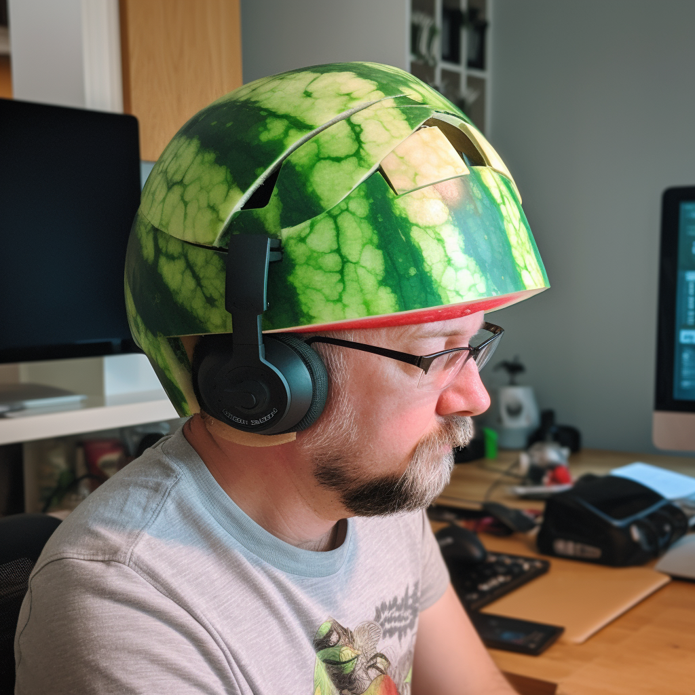

# Python基础教程

> 为什么蚂蚁要写这个教程：
>
> * 主要原因是……闲的
> * 次要原因是Python作为蚂蚁2007年就开始接触的编程语言，陪伴了他15年的时间，总想给它做些什么，因为它真的很有用
> * 还有一个私心是借此参考Swift Playgrounds写一个[Python在线游乐场](https://python.twinsant.com)，也算为Python的普及做些贡献
> * 最后感谢所有CPUG的早期创始人们，虽然邮件组已经变成了大妈的碎碎念，但蚂蚁永远怀念那段时光☀️

学习Python编程的基本原则

* 直接阅读[Python](https://www.python.org/)的[官方资料](https://wiki.python.org/moin/BeginnersGuideChinese)(蚂蚁找PSF的伙伴申请了编辑权限，已经把翻译改的体验好了一些)和[官方文档](https://docs.python.org/zh-cn/3/)：因为大部分二手的文章（尤其是百度里的中文内容）质量参差不齐、信息丢失、扭曲、落伍严重
  * 阅读CPUG[社区大妈的入门教程](http://s5.zoomquiet.top/100820-introPy/index.html)
  * [简明Python教程](https://www.woodpecker.org.cn/abyteofpython\_cn/chinese/)/ [GitHub库](https://github.com/LenKiMo/byte-of-python)
  * [深入Python](https://www.woodpecker.org.cn/diveintopython/)
  * [深入Python3](https://www.woodpecker.org.cn/diveintopython3/)
* 也可以阅读蚂蚁之前给内部的同学写的[Python入门小文档](https://www.yuque.com/twinsant/teacher/python)（需要注册一个语雀账号看）
* 最重要的原则是多动手，有诗云“纸上得来终觉浅，绝知此事要躬行”

<figure><figcaption></figcaption></figure>

好了，话不多说，让我们出发吧！


[python游乐场](https://app.gitbook.com/s/zFaa4KHjTxY4RdS4enJb/)


